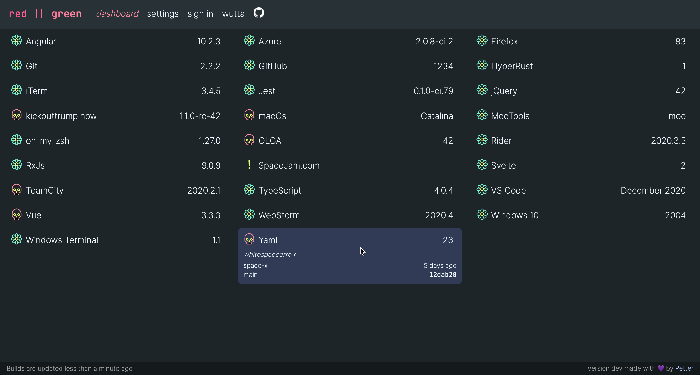
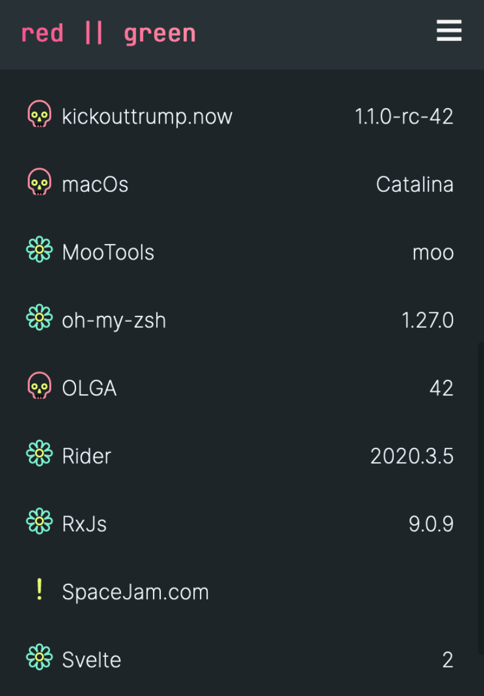

# [RedGreen](https://redgreen.app) is a buildscreen for TeamCity servers
The aim is to provide a clean visual interface for statuses of builds on TeamCity servers along with build meta information. This is a personal hobby effort. There are no deadlines. This is a work in progress, we are beta-ish stable ☺️. 
 
 Clearly see which builds are failing. Expand items for more info.
 
 
Fits in narrow screens and on your phone. 

## First: Notes on security
We use TeamCity's token-based authentication this means you'll need your Team City to be 2019.1 or newer.
- Set up a read only user in TeamCity for this buildscreen.
- Generate token for that user and use to sign into build screen. Token will be stored in browser localstorage.
- If your build data contains or is considered sensitive information, don't have a build screen.

## Features
- [x] List latest completed builds with meta infomation.
- [x] Fits narrow viewports and can sneak into busy info screens.
- [x] Filter which builds to display.
- [x] Error tracking using [sentry ](https://sentry.io/) with their standard sensitive data scrubbing.

## Todo
### Error visualization    
- [ ] Endpoint dosent exist
- [ ] Is not a TC server
- [x] Login
- [x] CORS
### PWAify
- [ ] Installable (manifest, icons etc)
- [ ] Cache static assets

## Nice to have
- [ ] Running builds indicator.
- [ ] Multiple server support (remember by localstorage/localdb and easy to swap).

## What the Config?
- `sentry.dsn`: is a sentry spesific url used to post errors to sentry.io. Defaults to Petter's sentry setup.
- `sentry.use`:  Defaults to `false` for dev purposes, but is flipped to `true` on production builds. Use `false` if you really don't want to report errors to sentry in production. Please _*do*_ report though 🙏.
- `version.commitRef`: reference to latest git commit. `npm run netlifybuild` or `node buildscript/write-config.js` will update `version.commitRef` in `dist/TeamCityBuildScreen/config.json` as part of our CI/CD process. Defaults to `"not prod"` for dev purposes.
```
{
  "sentry": {
    "dsn": "https://key@sentry.io/number",
    "use": true
  },
  "version": {
    "commitRef":"git hash/not prod"
  }
}

```

## Can't log in or get data? (CORS)
Your TeamCity server must accept requests from where ever you host the buildscreen. Please check [TeamCity docs](https://confluence.jetbrains.com/display/TCD18/REST+API#RESTAPI-CORSSupport) on how to do this.

## Development
This project is written in Angular.

### Angular CLI
You'll need Angular cli installed globally or you can use npx if you don't like global installs. The following assumes running the Angular cli.

### Development server
Run `ng serve` for a dev server. Navigate to [localhost:4200](http://localhost:4200/). The app will automatically reload if you change any of the source files.

### Code scaffolding
Run `ng generate component component-name` to generate a new component. You can also use `ng generate directive|pipe|service|class|guard|interface|enum|module`.

### Test
Run `npx run testNoWatch` for a single run. Run `npx run test` to keep te tests going. 

## Build
Run `ng build` to build the project. The build artifacts will be stored in the `dist/<ProjectName>` directory. Use the `--prod` flag for a production build.

## CI/CD [](https://app.netlify.com/sites/redgreen/deploys)
Changes merged to `main` will go live with the help of [netlify](https://netlify.com) ☺️

## Wanna run docker
1. Build with `docker build .`.
1. Note image hash, start with `docker run -d -p 8008:80 *hash* `.
1. Find running container hash with `docker container ls`.
1. And stop with `docker container stop *hash from ls*`.

## Contributing
Please read [CONTRIBUTING.md](CONTRIBUTING.md) for details on our code of conduct, and the process for submitting pull requests to us.

## Authors
* **Petter Hoel** - [petterhoel](https://github.com/petterhoel/)
* [chhenni](https://github.com/chhenni)

## License
This project is licensed under the MIT License - see the [LICENSE.md](LICENSE.md) file for details
